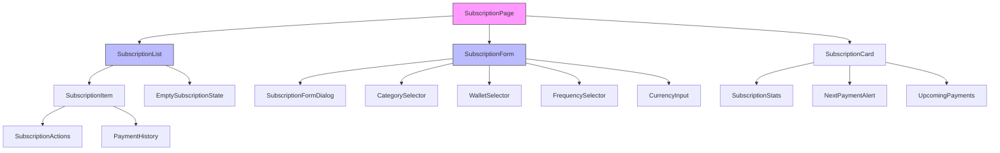
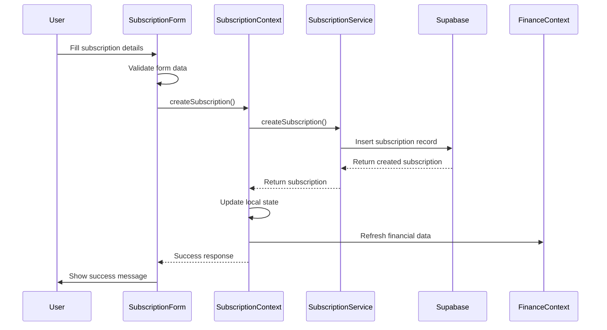
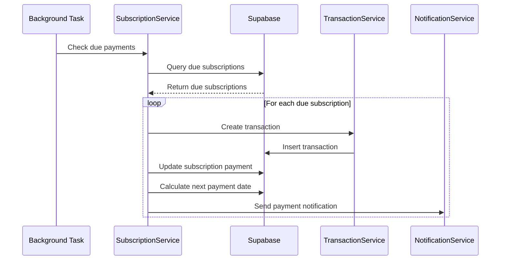

# Subscription Management Feature Design

## Overview

This document outlines the design for a Subscription Management feature in the Duitr personal finance management application. The feature will enable users to track recurring payments (subscriptions) such as Netflix, Spotify, utility bills, and other periodic expenses, providing better visibility into recurring financial commitments and automated transaction tracking.

## Technology Stack & Dependencies

- **Frontend**: React 18 + TypeScript + Vite
- **Backend**: Supabase (PostgreSQL + Row Level Security)
- **State Management**: React Query + React Context
- **UI Components**: shadcn/ui, Radix UI
- **Styling**: Tailwind CSS
- **Internationalization**: i18next + react-i18next
- **Form Management**: React Hook Form + Zod
- **Animation**: Framer Motion

## Component Architecture

### Component Hierarchy



### Component Definition

#### SubscriptionPage Component
```typescript
interface SubscriptionPageProps {
  // Main page component that orchestrates subscription management
}
```

#### Subscription Data Model
```typescript
interface Subscription {
  id: string;
  user_id: string;
  name: string;
  description?: string;
  amount: number;
  currency: string;
  category_id: string;
  wallet_id: string;
  frequency: 'daily' | 'weekly' | 'monthly' | 'quarterly' | 'yearly';
  start_date: string;
  next_payment_date: string;
  end_date?: string;
  is_active: boolean;
  auto_pay: boolean;
  provider?: string;
  icon?: string;
  color?: string;
  created_at: string;
  updated_at: string;
}

interface SubscriptionPayment {
  id: string;
  subscription_id: string;
  user_id: string;
  amount: number;
  payment_date: string;
  status: 'pending' | 'completed' | 'failed' | 'skipped';
  transaction_id?: string;
  created_at: string;
}
```

### Props/State Management

#### SubscriptionContext
```typescript
interface SubscriptionContextType {
  subscriptions: Subscription[];
  subscriptionPayments: SubscriptionPayment[];
  isLoading: boolean;
  addSubscription: (subscription: Omit<Subscription, 'id' | 'created_at' | 'updated_at'>) => Promise<void>;
  updateSubscription: (id: string, subscription: Partial<Subscription>) => Promise<void>;
  deleteSubscription: (id: string) => Promise<void>;
  processPayment: (subscriptionId: string) => Promise<void>;
  skipPayment: (subscriptionId: string) => Promise<void>;
  getUpcomingPayments: (days?: number) => Subscription[];
  getTotalMonthlyCommitment: () => number;
  refreshSubscriptions: () => Promise<void>;
}
```

### Lifecycle Methods/Hooks

#### useSubscriptions Hook
```typescript
const useSubscriptions = () => {
  const [subscriptions, setSubscriptions] = useState<Subscription[]>([]);
  const [isLoading, setIsLoading] = useState(true);
  
  // Fetch subscriptions from Supabase
  const fetchSubscriptions = useCallback(async () => {
    // Implementation
  }, []);
  
  // Calculate next payment dates
  const calculateNextPayment = useCallback((subscription: Subscription) => {
    // Implementation based on frequency
  }, []);
  
  // Auto-process payments (background task)
  const processScheduledPayments = useCallback(async () => {
    // Implementation
  }, []);
  
  return {
    subscriptions,
    fetchSubscriptions,
    processScheduledPayments,
    // ... other methods
  };
};
```

## Routing & Navigation

### Route Structure
```typescript
// Add to existing routes.tsx
{
  path: '/subscriptions',
  element: <SubscriptionPage />,
  requiresAuth: true
},
{
  path: '/subscriptions/:id',
  element: <SubscriptionDetailPage />,
  requiresAuth: true
}
```

### Navigation Integration
- Add "Subscriptions" tab to main navigation
- Include subscription overview in Dashboard
- Add quick access from transaction form for recurring transactions

## Styling Strategy

### Tailwind CSS Classes
Following existing Duitr design patterns:

```css
/* Subscription Card */
.subscription-card {
  @apply bg-[#242425]/80 border border-white/10 rounded-xl p-6 hover:bg-[#242425] transition-all duration-200;
}

/* Payment Status Indicators */
.status-active {
  @apply bg-green-500/20 text-green-400 border border-green-500/30;
}

.status-overdue {
  @apply bg-red-500/20 text-red-400 border border-red-500/30;
}

.status-upcoming {
  @apply bg-yellow-500/20 text-yellow-400 border border-yellow-500/30;
}

/* Frequency Badges */
.frequency-badge {
  @apply px-3 py-1 text-xs font-medium rounded-full bg-[#C6FE1E]/10 text-[#C6FE1E] border border-[#C6FE1E]/20;
}
```

## State Management

### React Context Integration
```typescript
// Extend existing FinanceContext
interface FinanceContextType {
  // ... existing properties
  subscriptions: Subscription[];
  subscriptionPayments: SubscriptionPayment[];
  addSubscription: (subscription: CreateSubscriptionRequest) => Promise<void>;
  updateSubscription: (id: string, updates: Partial<Subscription>) => Promise<void>;
  deleteSubscription: (id: string) => Promise<void>;
  getSubscriptionMetrics: () => SubscriptionMetrics;
}
```

### React Query Integration
```typescript
// Custom hooks for data fetching
const useSubscriptionsQuery = () => {
  return useQuery({
    queryKey: ['subscriptions'],
    queryFn: fetchSubscriptions,
    staleTime: 5 * 60 * 1000, // 5 minutes
  });
};

const useSubscriptionPaymentsQuery = (subscriptionId: string) => {
  return useQuery({
    queryKey: ['subscription-payments', subscriptionId],
    queryFn: () => fetchSubscriptionPayments(subscriptionId),
  });
};
```

## API Integration Layer

### Supabase Schema Extensions

```sql
-- Subscriptions table
CREATE TABLE IF NOT EXISTS public.subscriptions (
  id UUID DEFAULT gen_random_uuid() PRIMARY KEY,
  created_at TIMESTAMP WITH TIME ZONE DEFAULT now(),
  updated_at TIMESTAMP WITH TIME ZONE DEFAULT now(),
  user_id UUID REFERENCES auth.users(id) ON DELETE CASCADE NOT NULL,
  name TEXT NOT NULL,
  description TEXT,
  amount DECIMAL NOT NULL,
  currency TEXT NOT NULL DEFAULT 'IDR',
  category_id UUID REFERENCES public.categories(id),
  wallet_id UUID REFERENCES public.wallets(id) ON DELETE CASCADE NOT NULL,
  frequency TEXT NOT NULL CHECK (frequency IN ('daily', 'weekly', 'monthly', 'quarterly', 'yearly')),
  start_date DATE NOT NULL,
  next_payment_date DATE NOT NULL,
  end_date DATE,
  is_active BOOLEAN DEFAULT true,
  auto_pay BOOLEAN DEFAULT false,
  provider TEXT,
  icon TEXT,
  color TEXT DEFAULT '#6B7280'
);

-- Subscription payments table
CREATE TABLE IF NOT EXISTS public.subscription_payments (
  id UUID DEFAULT gen_random_uuid() PRIMARY KEY,
  created_at TIMESTAMP WITH TIME ZONE DEFAULT now(),
  subscription_id UUID REFERENCES public.subscriptions(id) ON DELETE CASCADE NOT NULL,
  user_id UUID REFERENCES auth.users(id) ON DELETE CASCADE NOT NULL,
  amount DECIMAL NOT NULL,
  payment_date DATE NOT NULL,
  status TEXT NOT NULL CHECK (status IN ('pending', 'completed', 'failed', 'skipped')),
  transaction_id UUID REFERENCES public.transactions(id),
  notes TEXT
);

-- Indexes for performance
CREATE INDEX IF NOT EXISTS subscriptions_user_id_idx ON public.subscriptions (user_id);
CREATE INDEX IF NOT EXISTS subscriptions_next_payment_idx ON public.subscriptions (next_payment_date);
CREATE INDEX IF NOT EXISTS subscription_payments_subscription_id_idx ON public.subscription_payments (subscription_id);
CREATE INDEX IF NOT EXISTS subscription_payments_user_id_idx ON public.subscription_payments (user_id);

-- Row Level Security policies
ALTER TABLE public.subscriptions ENABLE ROW LEVEL SECURITY;
ALTER TABLE public.subscription_payments ENABLE ROW LEVEL SECURITY;

-- Subscription policies
CREATE POLICY "Users can view their own subscriptions" ON public.subscriptions
  FOR SELECT USING (auth.uid() = user_id);

CREATE POLICY "Users can insert their own subscriptions" ON public.subscriptions
  FOR INSERT WITH CHECK (auth.uid() = user_id);

CREATE POLICY "Users can update their own subscriptions" ON public.subscriptions
  FOR UPDATE USING (auth.uid() = user_id);

CREATE POLICY "Users can delete their own subscriptions" ON public.subscriptions
  FOR DELETE USING (auth.uid() = user_id);

-- Subscription payments policies
CREATE POLICY "Users can view their own subscription payments" ON public.subscription_payments
  FOR SELECT USING (auth.uid() = user_id);

CREATE POLICY "Users can insert their own subscription payments" ON public.subscription_payments
  FOR INSERT WITH CHECK (auth.uid() = user_id);

CREATE POLICY "Users can update their own subscription payments" ON public.subscription_payments
  FOR UPDATE USING (auth.uid() = user_id);
```

### API Service Layer

```typescript
// subscriptionService.ts
export class SubscriptionService {
  static async getSubscriptions(userId: string): Promise<Subscription[]> {
    const { data, error } = await supabase
      .from('subscriptions')
      .select(`
        *,
        category:categories(name, icon, color),
        wallet:wallets(name, type, color)
      `)
      .eq('user_id', userId)
      .eq('is_active', true)
      .order('next_payment_date', { ascending: true });

    if (error) throw error;
    return data || [];
  }

  static async createSubscription(subscription: CreateSubscriptionRequest): Promise<Subscription> {
    const { data, error } = await supabase
      .from('subscriptions')
      .insert([subscription])
      .select()
      .single();

    if (error) throw error;
    return data;
  }

  static async processPayment(subscriptionId: string): Promise<void> {
    // Create transaction and update subscription payment
    const { error } = await supabase.rpc('process_subscription_payment', {
      subscription_id: subscriptionId
    });

    if (error) throw error;
  }

  static async getUpcomingPayments(userId: string, days: number = 7): Promise<Subscription[]> {
    const futureDate = new Date();
    futureDate.setDate(futureDate.getDate() + days);

    const { data, error } = await supabase
      .from('subscriptions')
      .select('*')
      .eq('user_id', userId)
      .eq('is_active', true)
      .lte('next_payment_date', futureDate.toISOString().split('T')[0]);

    if (error) throw error;
    return data || [];
  }
}
```

## Business Logic Layer

### Subscription Calculation Logic

```typescript
// subscriptionUtils.ts
export class SubscriptionCalculator {
  static calculateNextPaymentDate(
    currentDate: Date,
    frequency: Subscription['frequency']
  ): Date {
    const nextDate = new Date(currentDate);
    
    switch (frequency) {
      case 'daily':
        nextDate.setDate(nextDate.getDate() + 1);
        break;
      case 'weekly':
        nextDate.setDate(nextDate.getDate() + 7);
        break;
      case 'monthly':
        nextDate.setMonth(nextDate.getMonth() + 1);
        break;
      case 'quarterly':
        nextDate.setMonth(nextDate.getMonth() + 3);
        break;
      case 'yearly':
        nextDate.setFullYear(nextDate.getFullYear() + 1);
        break;
    }
    
    return nextDate;
  }

  static calculateMonthlyEquivalent(
    amount: number,
    frequency: Subscription['frequency']
  ): number {
    const multipliers = {
      daily: 30,
      weekly: 4.33,
      monthly: 1,
      quarterly: 1/3,
      yearly: 1/12
    };
    
    return amount * multipliers[frequency];
  }

  static getPaymentStatus(nextPaymentDate: Date): 'upcoming' | 'due' | 'overdue' {
    const today = new Date();
    const paymentDate = new Date(nextPaymentDate);
    const daysDiff = Math.ceil((paymentDate.getTime() - today.getTime()) / (1000 * 60 * 60 * 24));

    if (daysDiff < 0) return 'overdue';
    if (daysDiff <= 3) return 'due';
    return 'upcoming';
  }
}
```

### Subscription Analytics

```typescript
// subscriptionAnalytics.ts
export interface SubscriptionMetrics {
  totalMonthlyCommitment: number;
  totalYearlyCommitment: number;
  activeSubscriptionsCount: number;
  averageSubscriptionAmount: number;
  topCategories: Array<{
    category: string;
    amount: number;
    count: number;
  }>;
  upcomingPayments: Array<{
    subscription: Subscription;
    daysUntilPayment: number;
  }>;
}

export class SubscriptionAnalytics {
  static calculateMetrics(subscriptions: Subscription[]): SubscriptionMetrics {
    const activeSubscriptions = subscriptions.filter(sub => sub.is_active);
    
    const totalMonthlyCommitment = activeSubscriptions.reduce((total, sub) => {
      return total + SubscriptionCalculator.calculateMonthlyEquivalent(sub.amount, sub.frequency);
    }, 0);

    // Implementation for other metrics...
    
    return {
      totalMonthlyCommitment,
      totalYearlyCommitment: totalMonthlyCommitment * 12,
      activeSubscriptionsCount: activeSubscriptions.length,
      averageSubscriptionAmount: totalMonthlyCommitment / activeSubscriptions.length || 0,
      topCategories: [], // Implementation needed
      upcomingPayments: [] // Implementation needed
    };
  }
}
```

## Data Flow Between Layers

### Subscription Creation Flow



### Payment Processing Flow



## Testing Strategy

### Unit Testing Approach

```typescript
// subscription.test.ts
describe('SubscriptionCalculator', () => {
  describe('calculateNextPaymentDate', () => {
    it('should calculate next monthly payment correctly', () => {
      const currentDate = new Date('2024-01-15');
      const nextDate = SubscriptionCalculator.calculateNextPaymentDate(currentDate, 'monthly');
      expect(nextDate.getMonth()).toBe(1); // February
    });

    it('should handle leap years correctly', () => {
      const currentDate = new Date('2024-02-29');
      const nextDate = SubscriptionCalculator.calculateNextPaymentDate(currentDate, 'yearly');
      expect(nextDate.getFullYear()).toBe(2025);
    });
  });

  describe('calculateMonthlyEquivalent', () => {
    it('should convert yearly amount to monthly', () => {
      const monthlyAmount = SubscriptionCalculator.calculateMonthlyEquivalent(120, 'yearly');
      expect(monthlyAmount).toBe(10);
    });
  });
});

// subscriptionService.test.ts
describe('SubscriptionService', () => {
  beforeEach(() => {
    vi.clearAllMocks();
  });

  describe('getSubscriptions', () => {
    it('should fetch user subscriptions', async () => {
      const mockSubscriptions = [
        { id: '1', name: 'Netflix', amount: 15.99, frequency: 'monthly' }
      ];
      
      vi.mocked(supabase.from).mockReturnValue({
        select: vi.fn().mockReturnThis(),
        eq: vi.fn().mockReturnThis(),
        order: vi.fn().mockResolvedValue({ data: mockSubscriptions, error: null })
      } as any);

      const result = await SubscriptionService.getSubscriptions('user-id');
      expect(result).toEqual(mockSubscriptions);
    });
  });
});
```

### Integration Testing

```typescript
// subscription-integration.test.ts
describe('Subscription Integration', () => {
  it('should create subscription and update financial context', async () => {
    render(
      <FinanceProvider>
        <SubscriptionProvider>
          <SubscriptionForm />
        </SubscriptionProvider>
      </FinanceProvider>
    );

    // Fill form
    fireEvent.change(screen.getByLabelText('Subscription Name'), {
      target: { value: 'Netflix' }
    });
    fireEvent.change(screen.getByLabelText('Amount'), {
      target: { value: '15.99' }
    });
    
    // Submit form
    fireEvent.click(screen.getByText('Create Subscription'));
    
    // Verify subscription was created
    await waitFor(() => {
      expect(screen.getByText('Subscription created successfully')).toBeInTheDocument();
    });
  });
});
```