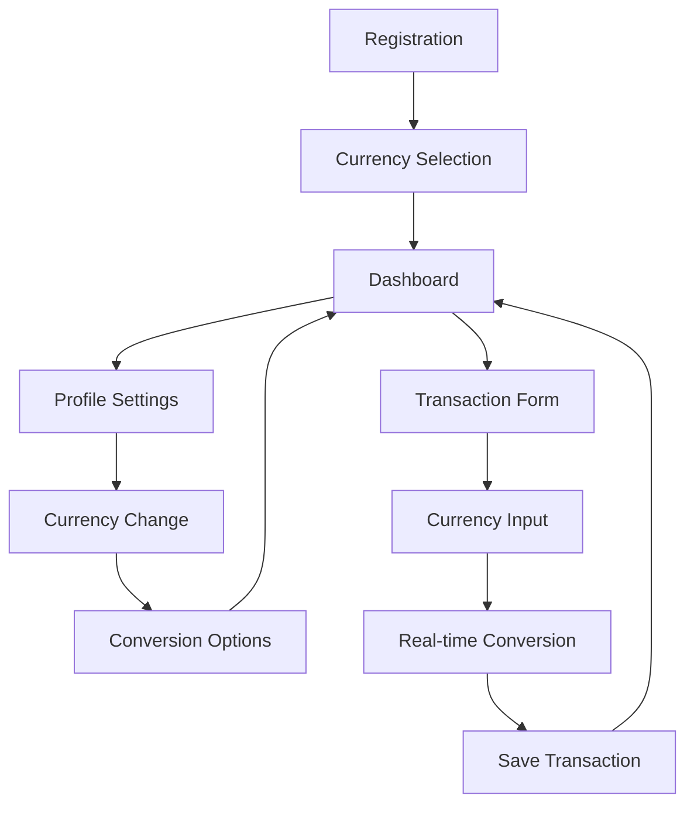

# Multi-Currency Support - Product Requirements Document

## 1. Product Overview

Duitr will implement comprehensive multi-currency support to enable users to manage finances in their preferred currency (initially IDR and USD). The feature includes currency selection during onboarding, profile-based currency switching, real-time exchange rate integration, and intelligent transaction handling that preserves historical accuracy while providing current value displays.

This enhancement addresses the growing need for international users and those dealing with multiple currencies, positioning Duitr as a globally-capable personal finance management solution.

## 2. Core Features

### 2.1 User Roles

| Role          | Registration Method                          | Core Permissions                                                |
| ------------- | -------------------------------------------- | --------------------------------------------------------------- |
| New User      | Email registration with currency selection   | Can select preferred currency during onboarding                 |
| Existing User | Existing account with currency change option | Can change currency in profile settings with conversion options |

### 2.2 Feature Module

Our multi-currency requirements consist of the following main pages:

1. **Currency Onboarding**: currency selection screen, welcome flow integration, preference saving.
2. **Profile Currency Settings**: current currency display, currency change interface, conversion options.
3. **Enhanced Transaction Forms**: currency-aware input fields, real-time conversion display, multi-currency validation.
4. **Currency Dashboard**: multi-currency balance overview, exchange rate display, conversion calculator.
5. **Transaction History**: original currency preservation, converted value display, currency filter options.

### 2.3 Page Details

| Page Name                  | Module Name                    | Feature description                                                                                                 |
| -------------------------- | ------------------------------ | ------------------------------------------------------------------------------------------------------------------- |
| Currency Onboarding        | Currency Selection             | Display currency picker with IDR/USD options, save user preference to profile, integrate with existing welcome flow |
| Currency Onboarding        | Welcome Integration            | Seamlessly integrate currency selection into existing onboarding process, maintain user experience consistency      |
| Profile Currency Settings  | Current Currency Display       | Show currently selected currency with symbol and code, display last exchange rate update timestamp                  |
| Profile Currency Settings  | Currency Change Interface      | Provide currency switcher with confirmation dialog, offer conversion options for existing data                      |
| Profile Currency Settings  | Conversion Options             | Allow users to choose between converting existing transactions or keeping original values                           |
| Enhanced Transaction Forms | Currency-Aware Input           | Automatically format input based on selected currency, show currency symbol in input fields                         |
| Enhanced Transaction Forms | Real-Time Conversion           | Display equivalent amount in alternate currency, update conversion rates automatically                              |
| Enhanced Transaction Forms | Multi-Currency Validation      | Validate amounts according to currency-specific rules, handle decimal precision differences                         |
| Currency Dashboard         | Multi-Currency Overview        | Show total balance in selected currency, display individual wallet balances with conversion                         |
| Currency Dashboard         | Exchange Rate Display          | Show current exchange rates, display rate change indicators, provide rate history access                            |
| Currency Dashboard         | Conversion Calculator          | Built-in currency converter tool, quick conversion between supported currencies                                     |
| Transaction History        | Original Currency Preservation | Maintain original transaction currency and amount, show currency code alongside amounts                             |
| Transaction History        | Converted Value Display        | Show current value in user's preferred currency, indicate when conversion is applied                                |
| Transaction History        | Currency Filter                | Filter transactions by original currency, search across currency types                                              |

## 3. Core Process

### New User Flow

1. User completes email registration
2. Welcome screen presents currency selection (IDR/USD)
3. User selects preferred currency
4. Currency preference is saved to user profile
5. User proceeds to main dashboard with selected currency

### Existing User Currency Change Flow

1. User navigates to Profile Settings
2. User accesses Currency Settings section
3. User selects new preferred currency
4. System presents conversion options for existing data
5. User confirms currency change
6. System updates user preference and applies conversions
7. User returns to dashboard with new currency

### Transaction Creation Flow

1. User opens transaction form
2. Form displays currency-aware input fields
3. User enters amount in preferred currency
4. System shows real-time conversion to alternate currency
5. User completes transaction details
6. Transaction is saved with original currency and converted values

## 4. User Interface Design

### 4.1 Design Style

* Primary colors: Blue (#3B82F6) for currency selection, Green (#10B981) for positive values

* Secondary colors: Gray (#6B7280) for conversion text, Red (#EF4444) for negative values

* Button style: Rounded corners with subtle shadows, currency-specific accent colors

* Font: Inter font family, 14px for body text, 16px for currency amounts, 12px for conversion text

* Layout style: Card-based design with clear currency indicators, top navigation with currency display

* Icon style: Outline icons for currencies, filled icons for actions, flag icons for country representation

### 4.2 Page Design Overview

| Page Name                  | Module Name        | UI Elements                                                                                                          |
| -------------------------- | ------------------ | -------------------------------------------------------------------------------------------------------------------- |
| Currency Onboarding        | Currency Selection | Large currency cards with flag icons, clear typography showing currency codes and names, prominent selection buttons |
| Profile Currency Settings  | Currency Display   | Current currency badge with flag icon, exchange rate information panel, last updated timestamp                       |
| Profile Currency Settings  | Currency Switcher  | Dropdown with currency options, confirmation modal with conversion preview, action buttons                           |
| Enhanced Transaction Forms | Currency Input     | Input fields with currency symbols, real-time conversion display below input, currency code indicators               |
| Currency Dashboard         | Balance Overview   | Multi-currency balance cards, conversion indicators, exchange rate widgets with trend arrows                         |
| Transaction History        | Currency Display   | Currency codes next to amounts, conversion tooltips, currency filter chips                                           |

### 4.3 Responsiveness

The multi-currency feature is designed mobile-first with touch-optimized currency selection interfaces. Currency conversion displays adapt to screen size with collapsible details on mobile and expanded views on desktop.

## 5. Technical Requirements

### 5.1 Database Schema Changes

* Add `preferred_currency` field to user profiles (VARCHAR(3))

* Add `currency` field to transactions table (VARCHAR(3))

* Add `original_amount` and `converted_amount` fields to transactions

* Create `exchange_rates` table for historical rate storage

* Add `base_currency` field to wallets table

### 5.2 Exchange Rate Integration

* Integrate with reliable exchange rate API (e.g., ExchangeRate-API)

* Implement rate caching with 1-hour refresh intervals

* Store historical rates for accurate conversions

* Handle API failures with cached fallback rates

### 5.3 Data Migration Strategy

* Default existing users to IDR currency

* Convert existing transaction amounts to base currency

* Preserve original transaction data during migration

* Provide user notification about currency feature availability

### 5.4 Performance Considerations

* Cache exchange rates in local storage

* Implement lazy loading for currency conversion displays

* Optimize database queries for multi-currency filtering

* Use efficient number formatting for different currencies

