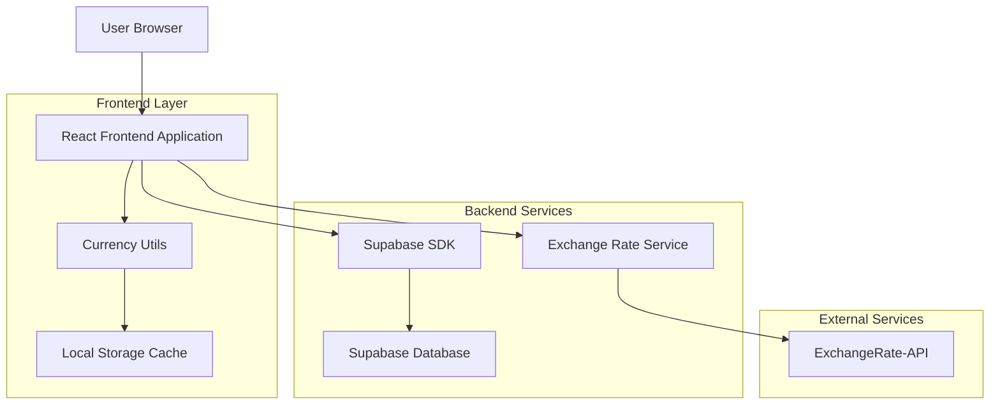
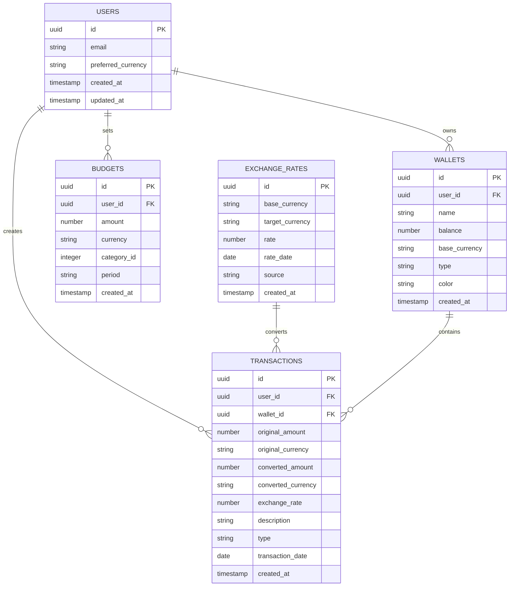

# Multi-Currency Support - Technical Architecture Document

## 1. Architecture Design



## 2. Technology Description

* Frontend: React\@18 + TypeScript + Tailwind CSS + Vite

* Backend: Supabase (PostgreSQL + Auth + Real-time)

* External API: ExchangeRate-API for real-time exchange rates

* Caching: Browser Local Storage + Supabase caching

* State Management: React Context + Custom Hooks

## 3. Route Definitions

| Route                | Purpose                                        |
| -------------------- | ---------------------------------------------- |
| /onboarding/currency | Currency selection for new users               |
| /profile/currency    | Currency settings and change interface         |
| /dashboard           | Enhanced dashboard with multi-currency support |
| /transactions        | Transaction list with currency filtering       |
| /transactions/add    | Currency-aware transaction creation            |
| /currency/calculator | Standalone currency conversion tool            |

## 4. API Definitions

### 4.1 Core API

**Exchange Rate Service**

```typescript
GET /api/exchange-rates
```

Request:

| Param Name | Param Type | isRequired | Description                        |
| ---------- | ---------- | ---------- | ---------------------------------- |
| base       | string     | true       | Base currency code (e.g., 'USD')   |
| target     | string     | true       | Target currency code (e.g., 'IDR') |
| date       | string     | false      | Historical date (YYYY-MM-DD)       |

Response:

| Param Name | Param Type | Description            |
| ---------- | ---------- | ---------------------- |
| rate       | number     | Exchange rate value    |
| timestamp  | string     | Rate timestamp         |
| source     | string     | Rate source identifier |

Example:

```json
{
  "rate": 15750.50,
  "timestamp": "2024-01-15T10:30:00Z",
  "source": "exchangerate-api"
}
```

**User Currency Preference**

```typescript
PUT /api/user/currency
```

Request:

| Param Name      | Param Type | isRequired | Description                   |
| --------------- | ---------- | ---------- | ----------------------------- |
| currency        | string     | true       | Currency code (IDR, USD)      |
| convertExisting | boolean    | false      | Convert existing transactions |

Response:

| Param Name | Param Type | Description      |
| ---------- | ---------- | ---------------- |
| success    | boolean    | Operation status |
| message    | string     | Status message   |

### 4.2 Database Operations

**Transaction with Currency**

```typescript
POST /api/transactions
```

Request:

| Param Name      | Param Type | isRequired | Description                             |
| --------------- | ---------- | ---------- | --------------------------------------- |
| amount          | number     | true       | Transaction amount                      |
| currency        | string     | true       | Transaction currency                    |
| originalAmount  | number     | true       | Original amount in transaction currency |
| convertedAmount | number     | true       | Amount in user's preferred currency     |
| exchangeRate    | number     | true       | Exchange rate used for conversion       |

## 5. Data Model

### 5.1 Data Model Definition



### 5.2 Data Definition Language

**User Profile Enhancement**

```sql
-- Add currency preference to user metadata
ALTER TABLE auth.users 
ADD COLUMN IF NOT EXISTS raw_user_meta_data JSONB DEFAULT '{}'::jsonb;

-- Update existing users with default currency
UPDATE auth.users 
SET raw_user_meta_data = COALESCE(raw_user_meta_data, '{}'::jsonb) || '{"preferred_currency": "IDR"}'::jsonb
WHERE raw_user_meta_data->>'preferred_currency' IS NULL;
```

**Enhanced Transactions Table**

```sql
-- Add currency fields to transactions
ALTER TABLE public.transactions 
ADD COLUMN IF NOT EXISTS original_amount NUMERIC NOT NULL DEFAULT 0,
ADD COLUMN IF NOT EXISTS original_currency VARCHAR(3) NOT NULL DEFAULT 'IDR',
ADD COLUMN IF NOT EXISTS converted_amount NUMERIC NOT NULL DEFAULT 0,
ADD COLUMN IF NOT EXISTS converted_currency VARCHAR(3) NOT NULL DEFAULT 'IDR',
ADD COLUMN IF NOT EXISTS exchange_rate NUMERIC DEFAULT 1.0,
ADD COLUMN IF NOT EXISTS rate_timestamp TIMESTAMP WITH TIME ZONE DEFAULT NOW();

-- Create index for currency queries
CREATE INDEX IF NOT EXISTS idx_transactions_original_currency ON public.transactions(original_currency);
CREATE INDEX IF NOT EXISTS idx_transactions_converted_currency ON public.transactions(converted_currency);
```

**Exchange Rates Table**

```sql
-- Create exchange rates table
CREATE TABLE IF NOT EXISTS public.exchange_rates (
    id UUID PRIMARY KEY DEFAULT gen_random_uuid(),
    base_currency VARCHAR(3) NOT NULL,
    target_currency VARCHAR(3) NOT NULL,
    rate NUMERIC NOT NULL,
    rate_date DATE NOT NULL,
    source VARCHAR(50) NOT NULL DEFAULT 'exchangerate-api',
    created_at TIMESTAMP WITH TIME ZONE DEFAULT NOW(),
    updated_at TIMESTAMP WITH TIME ZONE DEFAULT NOW()
);

-- Create unique constraint for currency pair and date
CREATE UNIQUE INDEX IF NOT EXISTS idx_exchange_rates_unique 
ON public.exchange_rates(base_currency, target_currency, rate_date);

-- Create index for rate queries
CREATE INDEX IF NOT EXISTS idx_exchange_rates_date ON public.exchange_rates(rate_date DESC);

-- Grant permissions
GRANT SELECT ON public.exchange_rates TO anon;
GRANT ALL PRIVILEGES ON public.exchange_rates TO authenticated;
```

**Enhanced Wallets Table**

```sql
-- Add currency support to wallets
ALTER TABLE public.wallets 
ADD COLUMN IF NOT EXISTS base_currency VARCHAR(3) NOT NULL DEFAULT 'IDR';

-- Create index for wallet currency queries
CREATE INDEX IF NOT EXISTS idx_wallets_currency ON public.wallets(base_currency);
```

**Enhanced Budgets Table**

```sql
-- Add currency support to budgets
ALTER TABLE public.budgets 
ADD COLUMN IF NOT EXISTS currency VARCHAR(3) NOT NULL DEFAULT 'IDR';

-- Create index for budget currency queries
CREATE INDEX IF NOT EXISTS idx_budgets_currency ON public.budgets(currency);
```

**Initial Exchange Rate Data**

```sql
-- Insert initial exchange rates (example data)
INSERT INTO public.exchange_rates (base_currency, target_currency, rate, rate_date, source)
VALUES 
    ('USD', 'IDR', 15750.00, CURRENT_DATE, 'initial'),
    ('IDR', 'USD', 0.0000635, CURRENT_DATE, 'initial')
ON CONFLICT (base_currency, target_currency, rate_date) DO NOTHING;
```

## 6. Component Architecture

### 6.1 Currency Management Components

```typescript
// Currency selection component for onboarding
interface CurrencySelectionProps {
  onCurrencySelect: (currency: string) => void;
  defaultCurrency?: string;
}

// Currency switcher for profile settings
interface CurrencySwitcherProps {
  currentCurrency: string;
  onCurrencyChange: (currency: string, convertExisting: boolean) => void;
}

// Currency display component
interface CurrencyDisplayProps {
  amount: number;
  currency: string;
  showConversion?: boolean;
  targetCurrency?: string;
}

// Currency input component
interface CurrencyInputProps {
  value: number;
  currency: string;
  onChange: (value: number) => void;
  showConversion?: boolean;
}
```

### 6.2 Service Layer

```typescript
// Exchange rate service
interface ExchangeRateService {
  getCurrentRate(base: string, target: string): Promise<number>;
  getHistoricalRate(base: string, target: string, date: string): Promise<number>;
  convertAmount(amount: number, fromCurrency: string, toCurrency: string): Promise<number>;
  cacheRates(rates: ExchangeRate[]): void;
  getCachedRate(base: string, target: string): number | null;
}

// Currency service
interface CurrencyService {
  getUserCurrency(userId: string): Promise<string>;
  updateUserCurrency(userId: string, currency: string): Promise<void>;
  getSupportedCurrencies(): string[];
  formatCurrency(amount: number, currency: string): string;
  parseCurrency(value: string, currency: string): number;
}
```

### 6.3 Custom Hooks

```typescript
// Currency management hook
interface UseCurrencyReturn {
  userCurrency: string;
  supportedCurrencies: string[];
  changeCurrency: (currency: string, convertExisting?: boolean) => Promise<void>;
  isLoading: boolean;
  error: string | null;
}

// Exchange rate hook
interface UseExchangeRateReturn {
  rate: number | null;
  convertAmount: (amount: number) => number;
  isLoading: boolean;
  error: string | null;
  lastUpdated: Date | null;
}

// Multi-currency transaction hook
interface UseMultiCurrencyTransactionReturn {
  createTransaction: (transaction: MultiCurrencyTransaction) => Promise<void>;
  convertExistingTransactions: (newCurrency: string) => Promise<void>;
  getTransactionsByCurrency: (currency: string) => Transaction[];
}
```

## 7. Implementation Phases

### Phase 1: Foundation (Week 1-2)

* Database schema updates

* Basic currency utilities

* Exchange rate service integration

* User currency preference storage

### Phase 2: Core Features (Week 3-4)

* Currency selection onboarding

* Profile currency settings

* Enhanced transaction forms

* Basic currency conversion

### Phase 3: Advanced Features (Week 5-6)

* Real-time conversion displays

* Currency calculator

* Historical rate preservation

* Performance optimizations

### Phase 4: Polish & Testing (Week 7-8)

* UI/UX refinements

* Comprehensive testing

* Error handling improvements

* Documentation completion

## 8. Security & Performance Considerations

### 8.1 Security

* Validate currency codes against supported list

* Sanitize exchange rate API responses

* Implement rate limiting for API calls

* Secure storage of API keys

### 8.2 Performance

* Cache exchange rates locally

* Implement efficient database queries

* Lazy load currency conversion displays

* Optimize number formatting operations

### 8.3 Error Handling

* Graceful fallback for API failures

* User-friendly error messages

* Automatic retry mechanisms

* Offline support with cached rates

