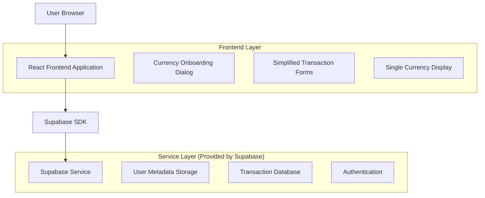
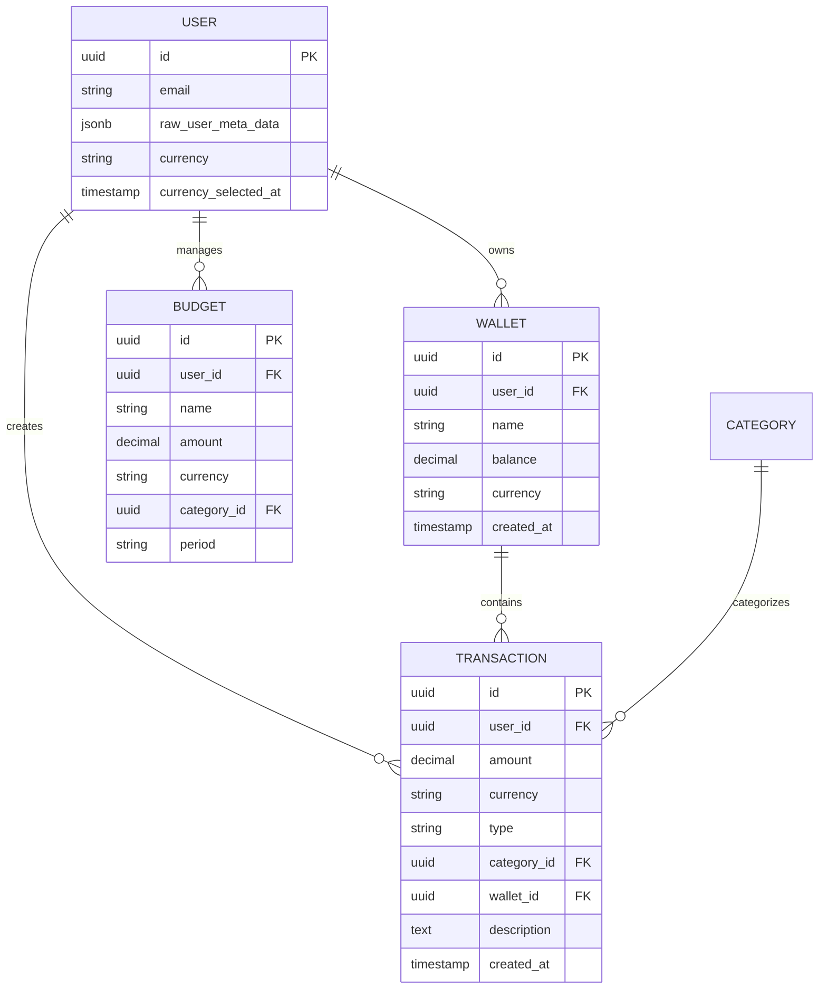

# Single-Currency System Technical Architecture

## 1. Architecture Design



## 2. Technology Description

* Frontend: React\@18 + TypeScript + Tailwind CSS + Vite

* Backend: Supabase (Authentication, Database, Real-time)

* State Management: React Context + Custom Hooks

* UI Components: Shadcn UI + Radix UI

* Validation: Zod schemas

## 3. Route Definitions

| Route                | Purpose                                             |
| -------------------- | --------------------------------------------------- |
| /dashboard           | Main dashboard with single-currency balance display |
| /transactions        | Transaction list and forms (currency-locked)        |
| /wallets             | Wallet management with single currency              |
| /settings            | User preferences (currency read-only)               |
| /onboarding/currency | Currency selection dialog (new users only)          |

## 4. API Definitions

### 4.1 Core API

**User Currency Preference**

```typescript
// Supabase User Metadata
interface UserMetadata {
  currency: 'USD' | 'IDR'
  currency_selected_at: string
  is_balance_hidden?: boolean
}
```

**Transaction Storage**

```typescript
interface Transaction {
  id: string
  user_id: string
  amount: number
  currency: 'USD' | 'IDR'
  type: 'income' | 'expense' | 'transfer'
  category_id: string
  wallet_id: string
  description?: string
  created_at: string
}
```

**Wallet Storage**

```typescript
interface Wallet {
  id: string
  user_id: string
  name: string
  balance: number
  currency: 'USD' | 'IDR'
  created_at: string
}
```

## 5. Data Model

### 5.1 Data Model Definition



### 5.2 Data Definition Language

**User Metadata Update**

```sql
-- Update auth.users metadata to include currency
-- This is handled via Supabase Auth metadata, no schema change needed
```

**Transaction Table Update**

```sql
-- Add currency column to transactions
ALTER TABLE transactions 
ADD COLUMN currency VARCHAR(3) NOT NULL DEFAULT 'IDR';

-- Create index for currency queries
CREATE INDEX idx_transactions_currency ON transactions(currency);
CREATE INDEX idx_transactions_user_currency ON transactions(user_id, currency);
```

**Wallet Table Update**

```sql
-- Add currency column to wallets
ALTER TABLE wallets 
ADD COLUMN currency VARCHAR(3) NOT NULL DEFAULT 'IDR';

-- Create index for wallet currency queries
CREATE INDEX idx_wallets_currency ON wallets(currency);
CREATE INDEX idx_wallets_user_currency ON wallets(user_id, currency);
```

**Budget Table Update**

```sql
-- Add currency column to budgets
ALTER TABLE budgets 
ADD COLUMN currency VARCHAR(3) NOT NULL DEFAULT 'IDR';

-- Create index for budget currency queries
CREATE INDEX idx_budgets_currency ON budgets(currency);
CREATE INDEX idx_budgets_user_currency ON budgets(user_id, currency);
```

**Row Level Security Updates**

```sql
-- Update RLS policies to include currency context
DROP POLICY IF EXISTS "Users can view own transactions" ON transactions;
CREATE POLICY "Users can view own transactions" ON transactions
    FOR SELECT USING (auth.uid() = user_id);

DROP POLICY IF EXISTS "Users can insert own transactions" ON transactions
CREATE POLICY "Users can insert own transactions" ON transactions
    FOR INSERT WITH CHECK (auth.uid() = user_id);

-- Similar updates for wallets and budgets tables
```

**Data Migration Script**

```sql
-- Migrate existing data to single currency
-- This script should be run carefully with backup

-- Set default currency for existing users based on their most common transaction currency
WITH user_currencies AS (
    SELECT 
        user_id,
        CASE 
            WHEN COUNT(*) FILTER (WHERE amount >= 1000000) > COUNT(*) FILTER (WHERE amount < 1000000)
            THEN 'IDR'
            ELSE 'USD'
        END as detected_currency
    FROM transactions 
    GROUP BY user_id
)
UPDATE transactions t
SET currency = uc.detected_currency
FROM user_currencies uc
WHERE t.user_id = uc.user_id;

-- Update wallets with same logic
WITH wallet_currencies AS (
    SELECT 
        w.id,
        CASE 
            WHEN w.balance >= 1000000 THEN 'IDR'
            ELSE 'USD'
        END as detected_currency
    FROM wallets w
)
UPDATE wallets w
SET currency = wc.detected_currency
FROM wallet_currencies wc
WHERE w.id = wc.id;
```

## 6. Implementation Phases

### Phase 1: Database Schema Updates

1. Add currency columns to transactions, wallets, budgets tables
2. Create necessary indexes
3. Update RLS policies
4. Run data migration scripts

### Phase 2: Authentication & Onboarding

1. Create CurrencyOnboardingDialog component
2. Update AuthContext to handle currency selection
3. Add currency detection logic for new users
4. Implement user metadata management

### Phase 3: Remove Conversion Features

1. Remove useExchangeRate hook
2. Remove CurrencyDisplay component
3. Remove conversion logic from FinanceContext
4. Update transaction forms to remove currency selection

### Phase 4: Update Core Components

1. Simplify CurrencyInput component
2. Update transaction forms (ExpenseForm, IncomeForm, TransferForm)
3. Update balance displays
4. Update wallet management

### Phase 5: Testing & Deployment

1. Update test suites
2. Test migration scripts
3. Deploy with feature flags
4. Monitor user experience

## 7. Component Changes

### Components to Remove

* `useExchangeRate.ts`

* `CurrencyDisplay.tsx`

* Currency conversion logic in `FinanceContext.tsx`

### Components to Modify

* `AuthContext.tsx` - Add currency onboarding logic

* `CurrencyInput.tsx` - Simplify to single currency

* `ExpenseForm.tsx` - Remove currency selection

* `IncomeForm.tsx` - Remove currency selection

* `TransferForm.tsx` - Remove currency selection

* `Dashboard.tsx` - Single currency display

### Components to Create

* `CurrencyOnboardingDialog.tsx` - Mandatory currency selection

* `useCurrencyOnboarding.ts` - Hook for onboarding logic

## 8. Migration Strategy

### For Existing Users

1. Detect most common currency from transaction history
2. Set as default currency in user metadata
3. Show one-time notification about system change
4. Allow currency change within 30 days of migration

### For New Users

1. Mandatory currency selection during first login
2. Block access to main app until selection is made
3. Save selection permanently in user metadata

### Rollback Plan

1. Keep conversion components in separate branch
2. Database changes are additive (currency columns)
3. Feature flags to enable/disable new system
4. Quick rollback capability if issues

