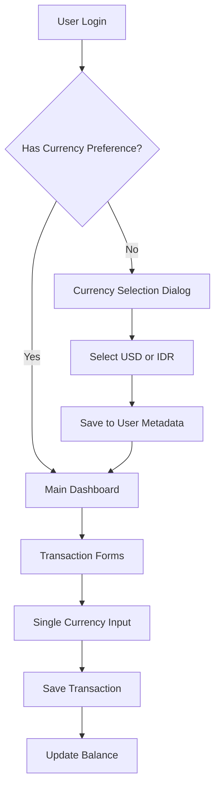

# Single-Currency System Product Requirements Document

## 1. Product Overview

Transition from dual-currency conversion system to a simplified single-currency-per-user approach where users select either USD or IDR during initial onboarding and all subsequent transactions are locked to that currency.

This change eliminates complexity around currency conversion, reduces maintenance overhead, and provides a cleaner user experience by removing exchange rate dependencies and conversion-related UI components.

## 2. Core Features

### 2.1 User Roles

| Role | Registration Method | Core Permissions |
|------|---------------------|------------------|
| New User | Email/Google registration | Must complete currency selection before accessing app |
| Existing User | Existing account | Maintains current currency preference or prompted to select |

### 2.2 Feature Module

Our single-currency system consists of the following main components:

1. **Currency Onboarding Dialog**: Mandatory currency selection (USD/IDR) during first login
2. **Transaction Forms**: Simplified forms without currency selection dropdowns
3. **Balance Display**: Single currency display without conversion options
4. **Settings Page**: Currency preference locked after initial selection

### 2.3 Page Details

| Page Name | Module Name | Feature description |
|-----------|-------------|---------------------|
| Onboarding Dialog | Currency Selection | Display USD/IDR choice with examples, save selection to user metadata, prevent app access until completed |
| Transaction Forms | Amount Input | Remove currency dropdown, use user's selected currency, validate amounts in single currency |
| Dashboard | Balance Display | Show balances in user's currency only, remove conversion toggles and exchange rate displays |
| Settings | Currency Preference | Display current currency as read-only, show migration notice for existing users |

## 3. Core Process

**New User Flow:**
1. User registers via email or Google
2. System detects new user without currency preference
3. Currency selection dialog appears (blocking)
4. User selects USD or IDR with visual examples
5. Selection saved to user metadata
6. User proceeds to main application

**Existing User Flow:**
1. User logs in with existing account
2. System checks for currency preference
3. If missing, show currency selection dialog
4. If present, proceed to main application

**Transaction Flow:**
1. User navigates to transaction form
2. Form displays amount input in user's currency
3. User enters amount and other details
4. Transaction saved with user's currency
5. Balance updated in same currency

## 4. User Interface Design

### 4.1 Design Style

- **Primary Colors**: Blue (#3B82F6) for USD, Green (#10B981) for IDR selection
- **Button Style**: Rounded corners with clear selection states
- **Font**: System font stack with 16px base size
- **Layout Style**: Modal dialog for onboarding, card-based transaction forms
- **Icons**: Currency symbols ($ and Rp) prominently displayed

### 4.2 Page Design Overview

| Page Name | Module Name | UI Elements |
|-----------|-------------|-------------|
| Currency Dialog | Selection Interface | Modal overlay, two large selection cards with currency symbols, example amounts (e.g., $100.00 vs Rp 1,500,000), confirm button |
| Transaction Forms | Amount Input | Single input field with currency symbol prefix, no dropdown, clean minimal design |
| Dashboard | Balance Cards | Currency symbol integrated into balance display, consistent formatting throughout |

### 4.3 Responsiveness

Mobile-first design with touch-optimized currency selection cards. Dialog adapts to screen size with appropriate spacing and button sizes for mobile interaction.
